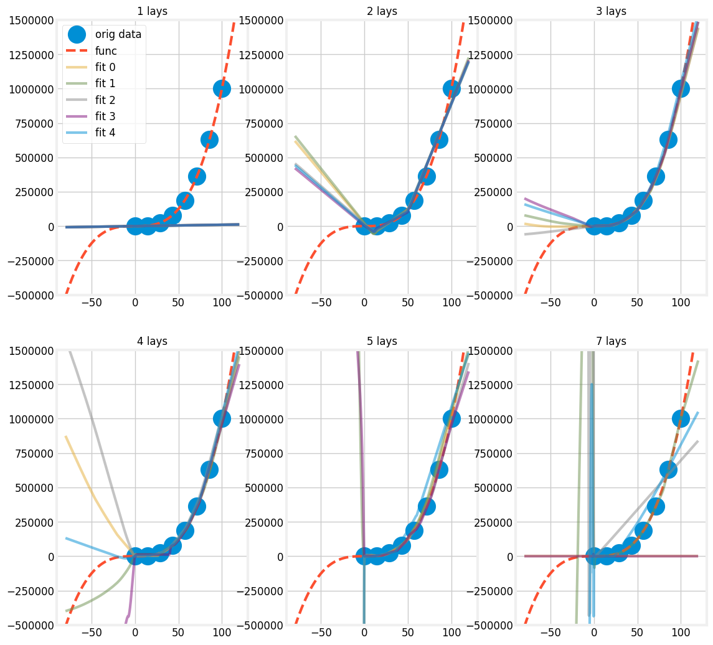

# how do DNNs fit simple functions?
- neural networks fit simple functions in some interesting ways
- below are networks with different numbers of layers fitting the function $x^3$ with only a few samples:

